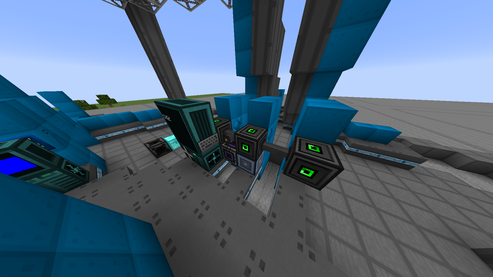
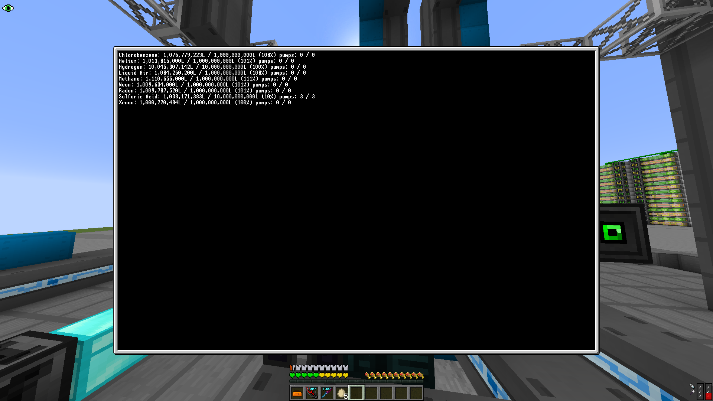

## Space Elevator Pumping Module Manager Script

A script which automatically configures your space pumping modules to level maintain a set of user-configurable fluids. It can work with any number of pumps and requires very little configuration.

Important note: this script requires a nightly GTNH release to function, since it relies on two newly added functions that allow computers to modify TT parameters.

## Setup




1. Connect a computer to your pumping modules via an adapter (MFUs recommended for clean setups). The computer must also be connected to a full block dual interface via an adapter (so that it can scan your network for fluids).
2. Install OpenOS & [OPPM](https://ocdoc.cil.li/tutorial:program:oppm) on the computer (requires internet card)
3. Run `oppm register RecursivePineapple/se-pump-mgr`
4. Run `oppm install se-pump-mgr`
5. Edit `/etc/se-pump-mgr/fluids.cfg` and set up your fluids
6. Run `se_pump_mgr` and optionally configure it to auto start (by adding it to your `/home/.shrc` file)

## Configuration File Format

This spec uses pseudocode that hopefully resembles lua. The format is very simple and there isn't a lot of configuration needed. An example file is included with the script.

```typescript
{
    fluids = {
        [fluid_id: string] = {
            // the amount of fluid to level maintain in litres
            amount = number;
            // the priority of this fluid (lower is higher, default is 1)
            priority = number;
            // the number of pumps to allocate to this fluid when pumping it
            pumps = number;
        }
    },
    // the number of seconds between ME system polls/pump updates (default 10)
    interval = number;
}
```

When a fluid needs to be pumped, the highest priority fluids will be pumped first. The `pumps` value controls how many 'parallels' the fluid gets; a value of 2 will allocate 2 parallels to it (note that MK2 and MK3 pumps have 4 parallels each and may pump 4 different fluids). The script will allocate as many parallels as it can. If there are too few pumps available, the script will shuffle fluids of equal priority every interval. If you have a priority-0 fluid with 2 parallels and 2 priority-1 fluids with 1 parallel but you only have 3 pumps, the script will pump two parallels of the priority-0 fluid and a random priority-1 fluid (changes periodically).
